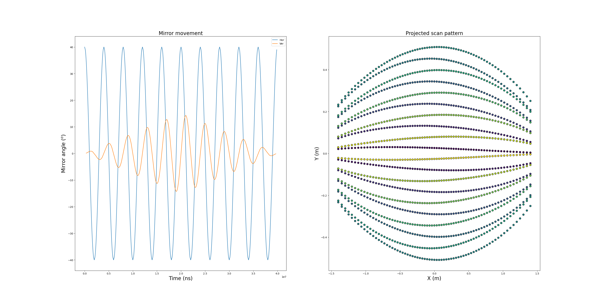
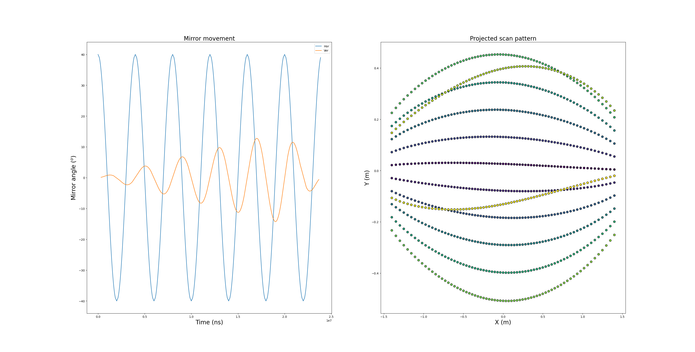

# Blickfeld RTX LiDAR generator for NVIDIA Omniverse

Tool to generate config files to generate Omniverse RTX LiDAR that emulates the Blickfeld Cube1.

## Dependencies
- numpy
- argparse
- matplotlib (to visualize scan pattern) [optional] 

## IsaacSim setup
Before generating new config files for Blickfeld LiDAR, IsaacSim need to be setup to find them. This only needs to be done once.

From IsaacSim installed location

```
mkdir ./exts/omni.isaac.sensor/data/lidar_configs/CUSTOM
```

Add the new directory to the search path of Omniverse sensor plugin. Open file ``` ./exts/omni.isaac.sensor/config/extension.toml ``` and find ```app.sensors.nv.lidar.profileBaseFolder```. Add ```"${app}/../exts/omni.isaac.sensor/data/lidar_configs/CUSTOM/"```

Now, any newly created JSON file can be added to ``` mkdir ./exts/omni.isaac.sensor/data/lidar_configs/CUSTOM ```

## Citing
This tool was created to support the research published in the following publication.

```
@inproceedings{Luong2025,
author = "Tuan Luong and Jordan Larson",
title = "{3D Keypoint Detectors from Scanning Mirror LIDAR Scans for Localization of Lunar Rovers}",
year = "2025",
month = "5",
 booktitle={2025 IEEE/ION Position, Location and Navigation Symposium (PLANS)}} 
```

## Example 
Visualization of scan pattern corresponds to 
```
python3 sim_bf1.py --num_scan_up 10 --num_scan_down 10 --hor_ang_res 10 --draw
```

Resulting file: ```BF1_250_70_30_10_10_10.json```




Visualization of scan pattern corresponds to 
```
python3 sim_bf1.py --num_scan_up 10 --num_scan_down 10 --hor_ang_res 2 --draw
```

Resulting file: ```BF1_250_70_30_10_10_2.json```



## Limitations
- Only "combined" scan mode supported
- Only "equidistant" horizontal scan mode supported